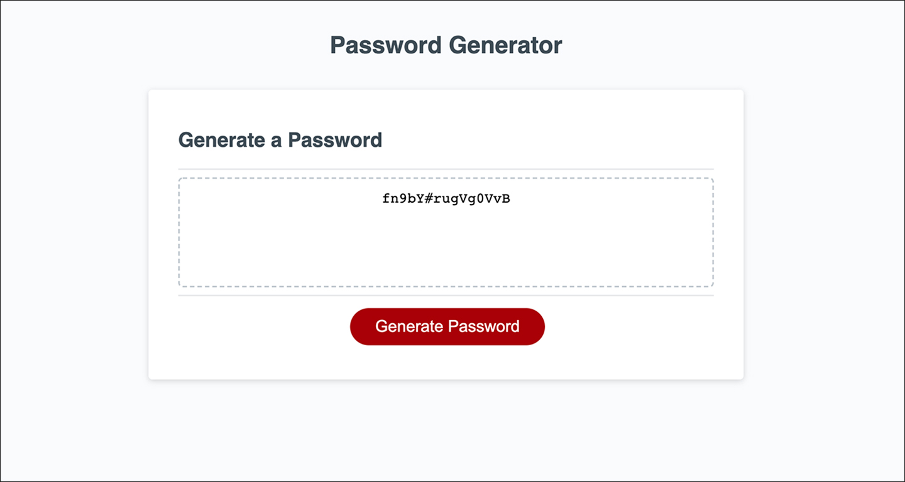

# RANDOM PASSWORD GENERATOR
&nbsp;

### Project Description:

&nbsp;

For this project I created a random password generator that presents the user with a series of questions about the criteria they would like to select. The user can choose any length for their password, ranging from 8 characters to 128 characters. They can also opt to use lower case letters, upper case letters, numbers, and special characters. Obviously, to generate a password, the user must select at least one of these options, but can select any combination of characters they would prefer. Having control over this criteria provides a user who has access to sensitive information much greater security and a stronger password option. If the user attempts to select a password that is less than 8 characters, greater than 128 characters, or enters a letter or symbol for the password length, they will be prompted to choose a valid number. Once they have selected all of their preferred password criteria, the user is given the result. If they are satisfied, they can copy their results to the clipboard. If for some reason, they would prefer a different password, they always have the option of generating a new one. This password generator is browser based and features dynamic HTML/CSS and is powered by JavaScript code. It has a responsive design that is very user friendly and adaptable to multiple screen sizes.

-----------
&nbsp;

&nbsp;

------------

&nbsp;

### Collaborators:
James Lamb
&nbsp;

https://github.com/Lambaa94 

    

